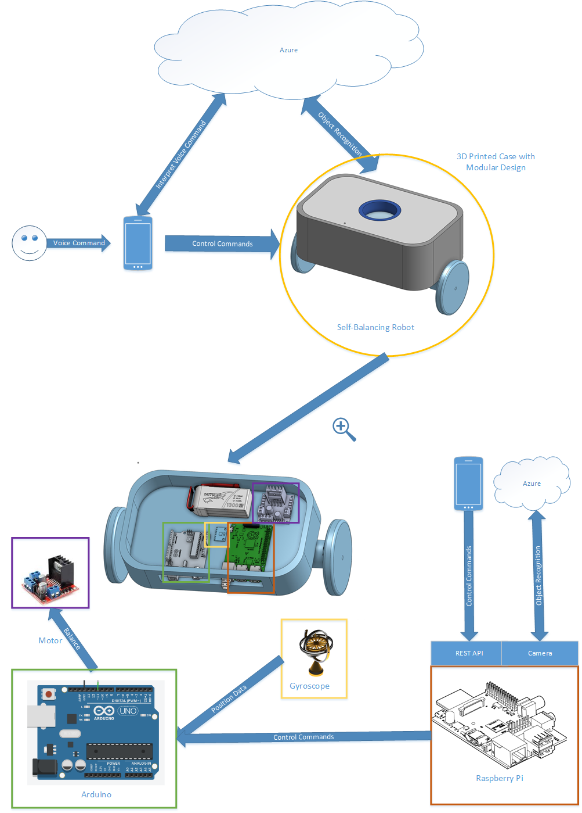

# ABOAVOBR - AutoBalancing Obstacle Avoiding Voice Obedient Beer Robot

| |Arduino|Raspberry Pi|App|
|:--:|:--:|:--:|:--:|
**Builds**|||not yet available|
**Deployments**||not yet setup|not yet available|
**Docker**||not yet ready|not yet ready|

The intention of this project is to provide you with the necessary details to 3D print, assemble and program your own autobalancing robot with some quite advanced features.

## System Architecture

## Bill of Materials
A detailed list with the materials needed including the 3D Model can be found [here](./Documents/BOM.md)

## Assembly instructions
TODO: Add instructions here

Starting point for collecting ideas:
https://www.instructables.com/id/Arduino-Balance-Balancing-Robot-How-to-Make/

