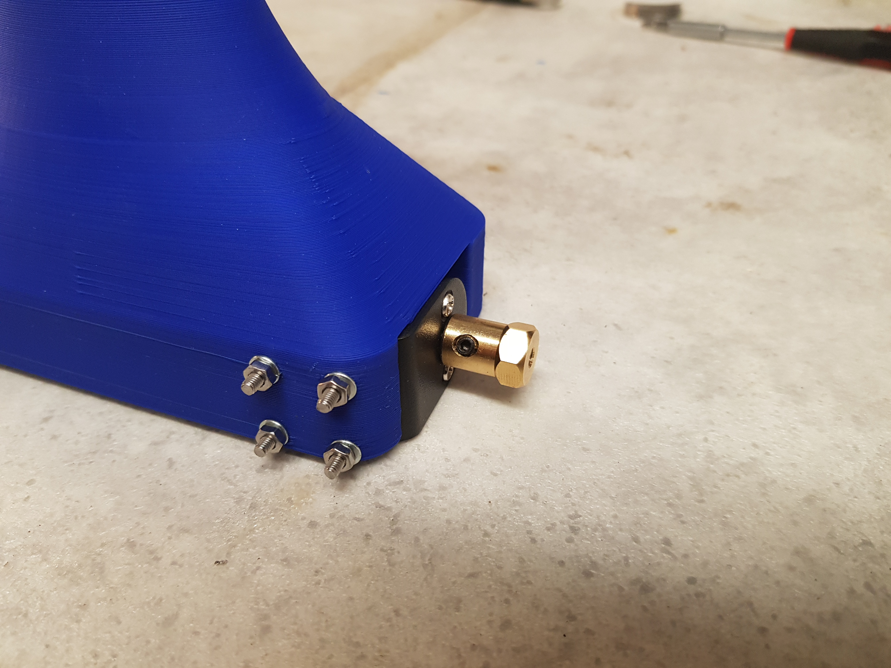
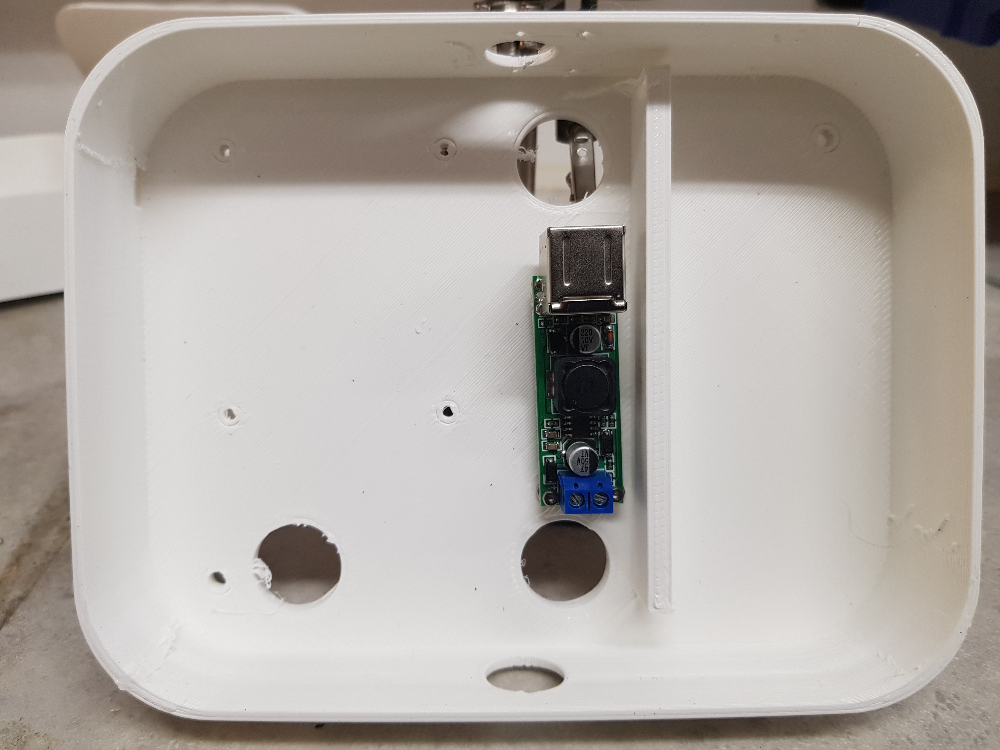
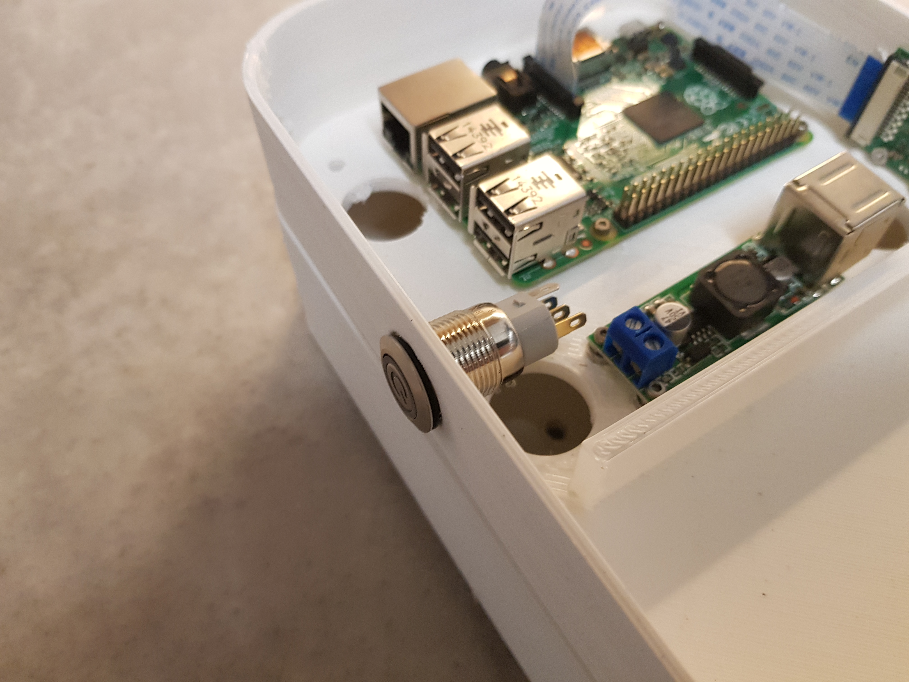

# ABOAVOBR - AutoBalancing Obstacle Avoiding Voice Obedient Beer Robot

| |Arduino|Raspberry Pi|App|
|:--:|:--:|:--:|:--:|
**Builds**||||
**Deployments**||||
**Release**||||

The intention of this project is to provide you with the necessary details to 3D print, assemble and program your own autobalancing robot with some quite advanced features.

## System Architecture

## Bill of Materials
A detailed list with the materials needed including the 3D Model can be found [here](./Documents/BOM.md)

## Assembly instructions
TODO: Add 3d models and reference them here for printing.

Fasten the motor mounts in the bottom part of the robot

Lengthen the red and white wires (VCC, GND) coming out from the motors

Mount the motors to the mounts

Mount the Arduino board in the following way to avoid putting pressure on the solder points under the board

Mount the Arduino board in the following position

Solder the MPU-6050 connectors like this. Try to make it as straight as possible.

Mount the MPU-6050 board in a similar way to the Arduino board to avoid pressure on the solder points.

Mount the motor driver in a similar way.

Mount the DC to USB converter in a similar way.

Mount the camera in the following way.

Mount the Raspberry in the following way.

Mount the on/off button like this.

Isolate all wires except the blue and green ones.

The main power connections are described here, but you should check the schematics at the end of the construction for a better overview.
Connect the On/Off button green wire to minus on the battery connector

Connect the battery positive connector to two wires
One connected to the DC to USB converter +
One connected to the motor controller +

Connect the On/Off button blue wire to
DC to USB converter - (ground)
Motor controller - (ground)

Schematics

TODO: Add instructions here

Starting point for collecting ideas:
https://www.instructables.com/id/Arduino-Balance-Balancing-Robot-How-to-Make/

